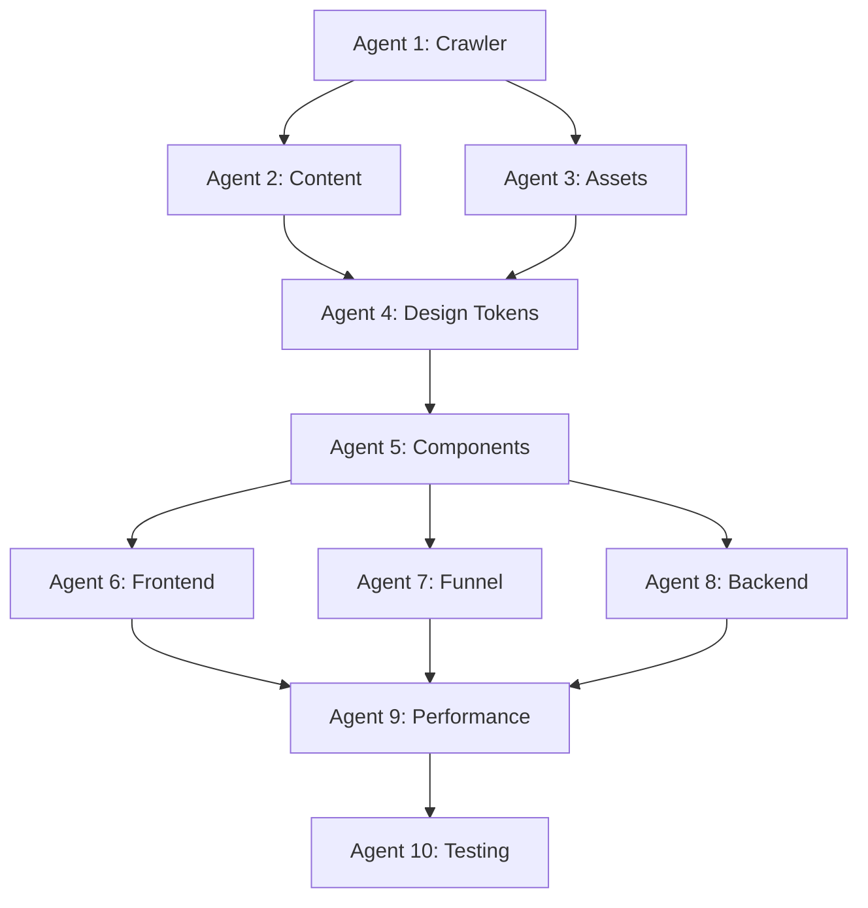

# Haywood Universal V2 - Master Implementation Plan

## 🎯 Project Overview

**Goal:** Build a production-ready, 20x improved version of haywooduniversal.com using a multi-agent architecture

**Approach:** Hybrid salvage + rebuild
- Salvage: Component patterns from existing repo
- Rebuild: Data-driven system with web scraping and modern stack

---

## 📂 Project Structure

```
haywood-universal-v2/
├── agents/                    # Agent implementations
│   ├── agent-1-crawler/       # Site crawler
│   ├── agent-2-content/       # Content extractor
│   ├── agent-3-assets/        # Asset manager
│   ├── agent-4-design/        # Design token extractor
│   ├── agent-5-components/    # Component architect
│   ├── agent-6-frontend/      # Frontend developer
│   ├── agent-7-funnel/        # Sales funnel engineer
│   ├── agent-8-backend/       # Backend integration
│   ├── agent-9-performance/   # Performance engineer
│   └── agent-10-testing/      # Testing & deployment
├── nextjs-app/                # Next.js 15 application
│   ├── app/                   # App Router pages
│   ├── components/            # React components
│   ├── lib/                   # Utilities
│   ├── prisma/                # Database schema
│   ├── public/                # Static assets
│   └── tests/                 # Test suites
├── output/                    # Agent output data
│   ├── crawl-data/            # Agent 1 output
│   ├── content-data/          # Agent 2 output
│   ├── asset-data/            # Agent 3 output
│   ├── design-tokens/         # Agent 4 output
│   └── component-specs/       # Agent 5 output
├── docs/                      # Documentation
│   ├── AGENT_PROMPTS.md       # Detailed agent prompts
│   ├── REPO_ASSESSMENT.md     # Current repo analysis
│   └── IMPLEMENTATION_PLAN.md # This file
└── scripts/                   # Utility scripts
    ├── run-agents.sh          # Execute agent pipeline
    └── setup-db.sh            # Database initialization
```

---

## 📋 Implementation Phases

### Phase 1: Data Collection & Analysis (Week 1)
**Duration:** 4-6 hours  
**Agents:** 1, 2, 3

#### Agent 1: Site Crawler (2 hours)
- [ ] Set up Playwright environment
- [ ] Fetch and parse sitemap
- [ ] Crawl all pages
- [ ] Extract navigation structure
- [ ] Take full-page screenshots
- [ ] Generate site-structure.json

**Deliverables:**
- `output/crawl-data/site-structure.json`
- `output/crawl-data/screenshots/*.png`
- `output/crawl-data/CRAWL_REPORT.md`

#### Agent 2: Content Extraction (1.5 hours)
- [ ] Parse HTML from crawled pages
- [ ] Extract all text blocks with semantic tags
- [ ] Identify CTAs and prioritize
- [ ] Map heading hierarchy
- [ ] Build content library
- [ ] Generate content-inventory.json

**Deliverables:**
- `output/content-data/content-inventory.json`
- `output/content-data/content-library.json`
- `output/content-data/CONTENT_GUIDE.md`

#### Agent 3: Asset Manager (2.5 hours)
- [ ] Download all images
- [ ] Generate responsive variants (4 sizes)
- [ ] Convert to modern formats (WebP, AVIF)
- [ ] Download fonts
- [ ] Extract SVG icons
- [ ] Calculate optimization savings
- [ ] Generate asset-manifest.json

**Deliverables:**
- `output/asset-data/images/original/*`
- `output/asset-data/images/optimized/*`
- `output/asset-data/fonts/*`
- `output/asset-data/asset-manifest.json`
- `output/asset-data/ASSET_GUIDE.md`

**Checkpoint:** Review agent outputs for completeness

---

### Phase 2: Design System & Architecture (Week 1-2)
**Duration:** 6-8 hours  
**Agents:** 4, 5

#### Agent 4: Design Token Extractor (3 hours)
- [ ] Analyze screenshots and CSS
- [ ] Extract complete color palette
- [ ] Map typography system
- [ ] Define spacing scale
- [ ] Document shadows and borders
- [ ] Create TailwindCSS config
- [ ] Generate design-tokens.json

**Deliverables:**
- `output/design-tokens/design-tokens.json`
- `output/design-tokens/tailwind.config.js`
- `output/design-tokens/globals.css`
- `output/design-tokens/DESIGN_SYSTEM.md`

#### Agent 5: Component Architect (3-5 hours)
- [ ] Map visual patterns to components
- [ ] Define atomic design hierarchy
- [ ] Create TypeScript interfaces
- [ ] Document component variants
- [ ] Design composition patterns
- [ ] Generate Storybook stories
- [ ] Define accessibility requirements

**Deliverables:**
- `output/component-specs/component-library-spec.json`
- `output/component-specs/typescript-interfaces.ts`
- `output/component-specs/COMPONENT_GUIDE.md`
- `output/component-specs/accessibility-checklist.md`

**Checkpoint:** Review design system and component architecture

---

### Phase 3: Core Development (Week 2-3)
**Duration:** 32-40 hours  
**Agents:** 6, 7, 8

#### Agent 6: Frontend Developer (16-20 hours)
- [x] Initialize Next.js 15 project
- [x] Set up TailwindCSS v4
- [x] Configure TypeScript strict mode
- [ ] Migrate design tokens
- [ ] Build component library (atoms → templates)
- [ ] Implement all pages
- [ ] Add form validation (React Hook Form + Zod)
- [ ] Implement route transitions
- [ ] Add error boundaries
- [ ] Optimize images with next/image

**Deliverables:**
- Complete Next.js application
- Component library
- All pages implemented
- Forms with validation
- Error handling

#### Agent 7: Sales Funnel Engineer (8-10 hours)
- [ ] Design 3-step booking wizard
- [ ] Implement exit-intent popup
- [ ] Build email capture forms
- [ ] Add social proof components
- [ ] Create urgency/scarcity elements
- [ ] Set up A/B testing infrastructure (PostHog)
- [ ] Implement analytics event tracking

**Deliverables:**
- Booking flow UI
- Conversion optimization components
- A/B testing setup
- FUNNEL_STRATEGY.md

#### Agent 8: Backend Integration (8-10 hours)
- [x] Set up Prisma with PostgreSQL
- [ ] Implement NextAuth.js
- [ ] Build API routes (bookings, contact, email)
- [ ] Integrate Stripe payments
- [ ] Set up Resend for emails
- [ ] Configure Sanity.io CMS
- [ ] Add PostHog analytics
- [ ] Implement Sentry error tracking

**Deliverables:**
- API routes
- Database schema and migrations
- Authentication system
- Payment integration
- Email service
- API_DOCUMENTATION.md

**Checkpoint:** Test all features end-to-end

---

### Phase 4: Optimization & Testing (Week 3-4)
**Duration:** 6-8 hours  
**Agents:** 9, 10

#### Agent 9: Performance Engineer (3-4 hours)
- [ ] Optimize images (next/image, blur placeholders)
- [ ] Implement code splitting
- [ ] Optimize font loading (next/font)
- [ ] Minimize JavaScript bundle
- [ ] Configure CDN (Vercel Edge)
- [ ] Optimize database queries
- [ ] Implement caching strategies
- [ ] Run Lighthouse audits

**Deliverables:**
- Optimized next.config.js
- Caching strategies
- Lighthouse CI configuration
- PERFORMANCE_GUIDE.md

**Targets:**
- Lighthouse Performance score > 90
- LCP < 2.5s
- FID < 100ms
- CLS < 0.1
- Bundle size < 150KB gzipped

#### Agent 10: Testing & Deployment (3-4 hours)
- [ ] Write unit tests (Vitest)
- [ ] Write E2E tests (Playwright)
- [ ] Set up visual regression tests (Chromatic)
- [ ] Implement accessibility tests (axe-core, Pa11y)
- [ ] Configure CI/CD pipeline (GitHub Actions)
- [ ] Set up monitoring (Vercel Analytics, Sentry)
- [ ] Create deployment runbooks
- [ ] Deploy to production

**Deliverables:**
- Complete test suite
- CI/CD pipeline
- Monitoring dashboards
- Deployment documentation

**Targets:**
- 80%+ code coverage
- All E2E tests passing
- 0 accessibility violations
- Automated deployment

---

## 🔄 Execution Strategy

### Sequential vs. Parallel Execution



**Parallel Opportunities:**
- Phase 1: Agent 2 and 3 can run after Agent 1
- Phase 3: Agents 6, 7, 8 can run simultaneously after setup

---

## 🎯 Success Criteria

### Data Collection (Phase 1):
- [x] All pages discovered and crawled
- [x] All assets downloaded and cataloged
- [x] Content extracted with semantic structure

### Design System (Phase 2):
- [ ] Complete design token library
- [ ] Component specifications defined
- [ ] TypeScript interfaces generated

### Development (Phase 3):
- [ ] All pages implemented and functional
- [ ] Forms working with validation
- [ ] API routes operational
- [ ] Payment integration tested

### Quality (Phase 4):
- [ ] Lighthouse score > 90
- [ ] Core Web Vitals all green
- [ ] 80%+ test coverage
- [ ] CI/CD pipeline operational
- [ ] Monitoring configured

---

## 📊 Progress Tracking

### Week 1: Foundation
- [ ] Phase 1 Complete (Data Collection)
- [ ] Phase 2 Started (Design System)

### Week 2: Development
- [ ] Phase 2 Complete (Design System)
- [ ] Phase 3 Started (Core Development)

### Week 3: Features & Integration
- [ ] Phase 3 Complete (Core Development)
- [ ] Phase 4 Started (Optimization)

### Week 4: Quality & Launch
- [ ] Phase 4 Complete (Optimization & Testing)
- [ ] Production deployment
- [ ] Post-launch monitoring

---

## 🚀 Next Steps

1. **Review this plan** with stakeholders
2. **Set up development environment**
3. **Run Agent 1** (Site Crawler)
4. **Review Agent 1 output** before proceeding
5. **Execute remaining agents** in sequence
6. **Monitor progress** against success criteria

---

## 📝 Notes

- Each agent has detailed prompts in `docs/AGENT_PROMPTS.md`
- Current repo assessment in `docs/REPO_ASSESSMENT.md`
- Agent implementations in `agents/` directory
- All agent outputs saved to `output/` directory

---

## 🔗 Resources

- **Original Site:** https://haywooduniversal.com
- **Current Repo:** https://github.com/DaBigHomie/leeha-haywooduniversal.com
- **Project Management:** [Link to project tracker]
- **Figma Designs:** [Link to designs when available]
